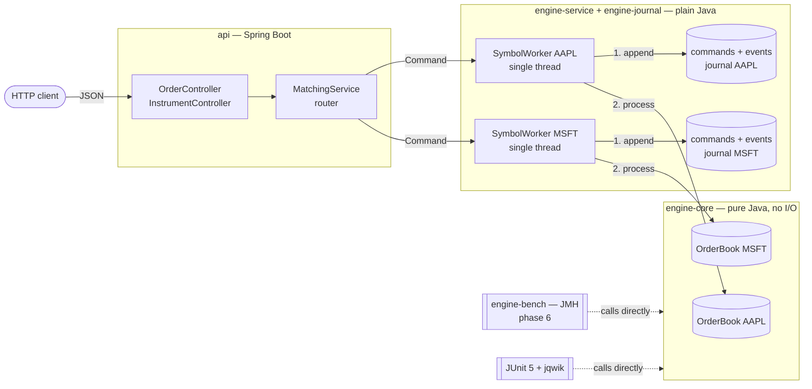
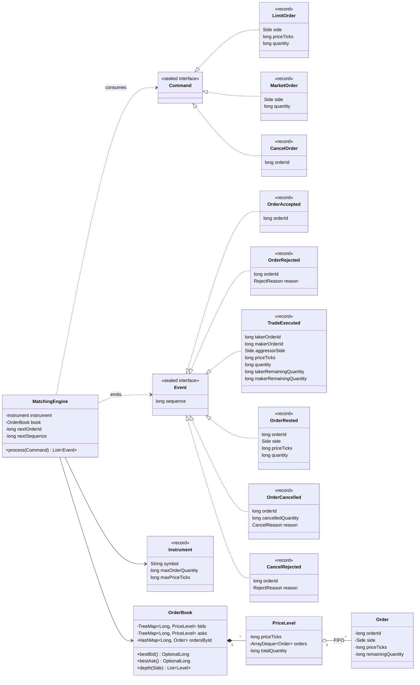
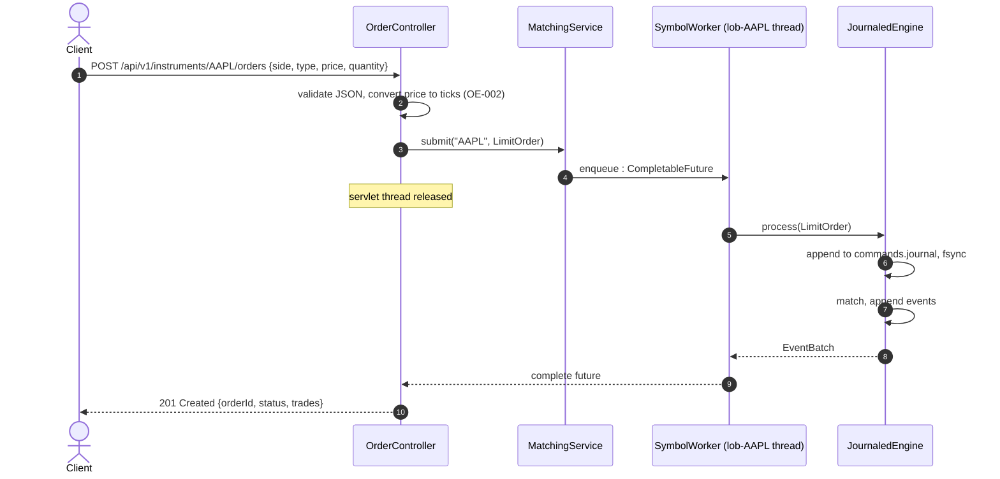
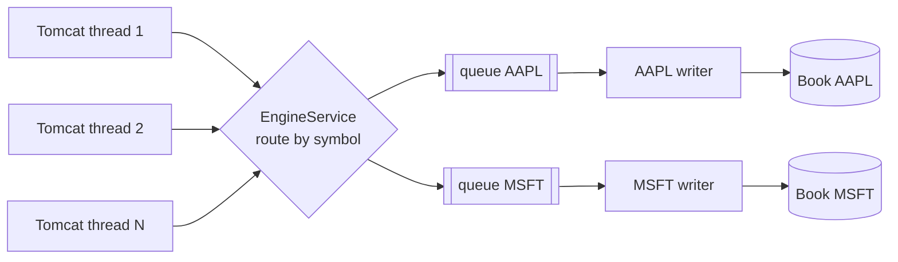

# Order Book — LOB Matching Engine

[](../../actions/workflows/ci.yml)


A **limit order book (LOB) matching engine** written in Java 21: price-time priority matching,
a REST API on Spring Boot, and published JMH benchmarks.

The goal is engineering rigour rather than feature count. The engine is **deterministic**,
backed by **invariant tests**, and **measured before it is optimised**.

> **Status: Phase 3, Connectivity (in progress).** Price-time matching
> ([rulebook](docs/rulebook/continuous-trading.md)) is durable, with a write-ahead journal, crash
> recovery and a replay tool ([resilience rules](docs/rulebook/resilience.md)). Every listed instrument
> runs on its own writer thread with a bounded queue ([order-entry rules](docs/rulebook/order-entry.md)),
> and a [REST API](docs/interfaces/rest-api.md) with OpenAPI exposes order entry and book depth.
> The FIX gateway comes next (see [Roadmap](#roadmap)).

---

## Table of contents

1. [Architecture](#architecture)
2. [Design patterns](#design-patterns)
3. [UML](#uml)
4. [Key technical decisions](#key-technical-decisions)
5. [Build & run](#build--run)
6. [Testing strategy](#testing-strategy)
7. [Roadmap](#roadmap)

---

## Architecture

**Guiding principle: the engine is a plain Java library. Spring Boot is only the access layer
around it.**



| Module | Responsibility | Allowed dependencies |
|---|---|---|
| `engine-core` | Order book, matching, commands and events, snapshot/restore | JDK only, no I/O (Spring is **banned by the build**) |
| `engine-journal` | Write-ahead journal, event journal, snapshots, recovery, replay tool | `engine-core`, JDK only |
| `engine-service` | One writer thread and bounded queue per instrument, routing, price conversion, refusals | `engine-journal`, JDK only |
| `api` | REST adapter: JSON, validation, problem details, OpenAPI, configuration | `engine-service`, Spring Boot |
| `engine-bench` *(phase 6)* | JMH micro-benchmarks | `engine-core`, JMH |

Why the core is isolated:
- **Benchmarks measure the algorithm**, not Tomcat or Jackson.
- **Core tests run in milliseconds** without a Spring context.
- The boundary is **checked by the compiler and by `maven-enforcer`**, not left to good intentions.

### Concurrency model

**Each order book is processed sequentially. Different books are processed in parallel.**

Matching depends on strict ordering: an incoming buy is matched against resting sells by best price, then by
arrival time. Two threads mutating the same book would break time priority. They could also fill the same
liquidity twice. Each instrument therefore owns **one single-writer thread**. Instruments never interact,
so they run in parallel with no locks.

---

## Design patterns

| Pattern | Where | Why |
|---|---|---|
| **Single Writer** (LMAX-style) | `SymbolWorker`: one thread owns one `OrderBook` | No locks and no races on the critical path. The result is deterministic. Real exchanges work this way. |
| **Command → Events** | `MatchingEngine.process(Command) : List<Event>` | One input and one output, with no hidden side effects. Tests read as "given these orders, expect these events". Replay comes for free (phase 2). |
| **Algebraic data types** (sealed interfaces + records) | `Command`, `Event` | Java 21 `switch` pattern matching is **exhaustive**: forgetting to handle a case is a compile error. |
| **Router** | `MatchingService` sends a command to the `SymbolWorker` that owns its symbol | Keeps concurrency out of the domain. |
| **Write-ahead log + snapshots** | `JournaledEngine`: journal the command, then process it | Crash recovery is a replay. The same mechanism serves audit and debugging. |
| **Adapter** (light hexagonal) | `api` translates HTTP and decimal prices to and from core commands and ticks | The domain stays independent of the transport. |

**Rejected for now (YAGNI):** a Strategy for the matching algorithm (there is only one: price-time),
an Observer or event bus, full hexagonal ports, Kafka, a database, and the LMAX Disruptor. Each can be
added later if a benchmark or a requirement justifies it.

---

## UML

### Class diagram: domain model



### Sequence diagram: `POST /orders`



### Thread model



Many request threads feed one queue per symbol. A queue has exactly one consumer, so each book is
mutated by a single thread and never needs a lock.

---

## Key technical decisions

The full rationale is in [ADR-0001](docs/adr/0001-foundations.md), [ADR-0002](docs/adr/0002-core-engine-model.md)
[ADR-0003](docs/adr/0003-journal-and-recovery.md) [ADR-0004](docs/adr/0004-service-layer.md) and [ADR-0005](docs/adr/0005-rest-api.md).
The matching behaviour itself is specified in the [rulebook](docs/rulebook/continuous-trading.md).

| Decision | Choice | Reason |
|---|---|---|
| Price representation | `long` ticks | `double` causes rounding errors. `BigDecimal` allocates on the hot path. Conversion happens in the API layer. |
| Book sides | `TreeMap<Long, PriceLevel>` | Sorted best price in O(log n). Simple and correct first. |
| Time priority | `ArrayDeque<Order>` per price level | FIFO by construction. |
| Cancel | O(n) inside a price level (v1) | Deliberate. It will be measured with JMH and then optimised to O(1) in phase 6. |
| Order IDs | Assigned by the engine, per instrument | Deterministic replay ([ADR-0002](docs/adr/0002-core-engine-model.md)). |
| Ordering and time | Gap-free sequence numbers; one µs UTC timestamp per command, taken at ingress and journaled | Determinism and reproducible replay ([ADR-0003](docs/adr/0003-journal-and-recovery.md)). |
| Durability | Write-ahead journal per instrument, CRC-framed, fsync per command by default | No acknowledged order is lost; journals are never rewritten (record keeping). |
| Overload | Bounded queue per instrument; a full queue refuses at once (`OVERLOADED`) | Predictable latency instead of unbounded queuing ([ADR-0004](docs/adr/0004-service-layer.md)). |
| Errors | Typed `OrderRejected(reason)`, no exceptions on the hot path | Rejection is a business outcome, not an error. |
| Instruments | Declared at startup (`application.yml`) | Exchanges do not create symbols on demand. |

---

## Build & run

Requirements: **JDK 21+**. Maven is not required because the wrapper is included.

```bash
./mvnw verify                                   # build, tests and quality gates
./mvnw -pl engine-core,engine-journal,engine-service -am -Pmutation verify   # mutation testing (PIT), slower
./mvnw -pl api -am install -DskipTests && \
  ./mvnw -pl api spring-boot:run                # start the venue on :8080 (journals in ./data)
```

On Windows, use `mvnw.cmd` in place of `./mvnw`.

### Trading through the REST API

The full contract is in [`docs/interfaces/rest-api.md`](docs/interfaces/rest-api.md); a Swagger UI is
served at <http://localhost:8080/swagger-ui.html>.

```bash
curl -s -X POST localhost:8080/api/v1/instruments/AAPL/orders -H 'Content-Type: application/json' \
     -d '{"side":"SELL","type":"LIMIT","price":"185.30","quantity":10}'
curl -s -X POST localhost:8080/api/v1/instruments/AAPL/orders -H 'Content-Type: application/json' \
     -d '{"side":"BUY","type":"LIMIT","price":"185.35","quantity":4}'
```

```json
{"orderId":2,"status":"FILLED","commandSequence":2,"timestamp":"2026-10-08T12:21:19.603850Z",
 "filledQuantity":4,"restingQuantity":0,"cancelledQuantity":0,
 "trades":[{"sequence":4,"makerOrderId":1,"price":"185.30","quantity":4}]}
```

An off-tick price is refused before it reaches the engine:

```json
{"status":422,"title":"Price off the tick grid","reason":"OFF_TICK_PRICE",
 "detail":"The price is not a multiple of the tick size of AAPL","instance":"/api/v1/instruments/AAPL/orders"}
```

### Replaying a journal

`lob-replay` rebuilds an instrument's book from its journal, at any command, and can check that the
current code regenerates exactly the recorded events. It never modifies the files.

```bash
./mvnw -q install -DskipTests
CP=engine-core/target/engine-core-0.1.0-SNAPSHOT.jar:engine-journal/target/engine-journal-0.1.0-SNAPSHOT.jar
java -cp "$CP" io.github.ahmedberrada.lob.journal.ReplayTool <instrument-dir> [--to <sequence>] [--verify]
```

```
Instrument      AAPL (max quantity 1000 lots, max price 100000 ticks)
Commands        5 replayed, last at 2026-10-08T09:11:38.669599Z
Book            3 resting orders
  side          price     quantity   orders
  SELL          18510           45        1
  BUY           18500           10        1
  BUY           18495           30        1
Verification    OK: 5 event batches identical to the event journal
```

---

## Testing strategy

| Layer | Tooling | What it proves |
|---|---|---|
| Core scenarios | JUnit 5 + AssertJ | Exact event sequences for partial fills, multi-level sweeps, FIFO, market orders, cancels, rejections |
| Core invariants | jqwik (property-based) | Book never crossed, quantity conserved, no gaps in IDs or sequences, determinism |
| Reference model | jqwik + naive oracle in test sources | Random command streams give exactly the same events as a deliberately simple implementation |
| Architecture | ArchUnit | Core uses only the JDK: no clock, randomness, threads, I/O or floating point |
| Traceability | `RulebookTraceabilityTest` | Every rulebook rule is cited by a test (`@Rulebook("CT-xxx")`) |
| Crash recovery | Second JVM killed with SIGKILL | No acknowledged command lost; recovered state equals a fresh replay |
| Journal properties | jqwik | Cutting either journal at any byte recovers exactly the complete commands |
| Corruption | JUnit | Damaged records, sequence gaps, foreign or swapped files are refused |
| Concurrency | 8 concurrent clients, 2 instruments | Each instrument's acknowledgements equal sequential processing in sequence order |
| Overload, halt, shutdown | Worker held in a blocking test clock | Full queues refuse, failed writes halt, shutdown drains the queue |
| Quality gates | JaCoCo, PIT | ≥ 90 % line and branch coverage; ≥ 80 % mutation score on every engine module |
| REST API | Spring `MockMvcTester` on the real service | Every outcome's HTTP status and problem `reason`; strict JSON (a test fails if it is relaxed) |
| Refusal mapping | `@WebMvcTest` with a stubbed service | Overload (`Retry-After`), halt, shutdown and unknown-outcome responses |
| Contract | OpenAPI test | The published document lists exactly the implemented endpoints |
| End to end | Real port, `java.net.http`, two application starts | Concurrent orders over HTTP; the book survives a restart |
| Performance *(phase 6)* | JMH | Throughput and p50 / p99 / p99.9 latency, with published methodology |

---|---|---|
| Core scenarios | JUnit 5 + AssertJ | Partial fills, multi-level sweeps, FIFO at equal price, cancels, rejections |
| Core invariants | jqwik (property-based) | Book is never crossed, quantity is conserved, FIFO holds, no negative quantity |
| Web layer | `@WebMvcTest` | Validation and HTTP status codes |
| End-to-end | one `@SpringBootTest` | Wiring |
| Performance | JMH | Throughput and p50 / p99 / p99.9 latency, with published methodology |

---

## Roadmap

The full plan, with exit criteria per phase, is in [`docs/ROADMAP.md`](docs/ROADMAP.md).

| # | Phase | Status |
|---|---|---|
| 0 | **Foundations**: multi-module build, CI, enforced module boundary, ADR | ✅ |
| 1 | **Core engine**: rulebook, LIMIT / MARKET / cancel, property tests, reference model, quality gates | ✅ |
| 2 | **Durability & audit**: write-ahead journal, snapshots, crash recovery, replay | ✅ |
| 3 | **Connectivity**: thread per symbol, FIX order entry, market data feeds, admin REST | ⏳ |
| 4 | **Venue functionality**: advanced orders, auctions, trading phases, circuit breakers | |
| 5 | **Pre-trade risk & members** | |
| 6 | **Performance**: JMH, zero-allocation hot path, published latency | |
| 7 | **Regulatory evidence**: MiFID II compliance matrix, RTS 22 / 24 reporting, surveillance | |
| 8 | **Security & supply chain**: mTLS, OIDC, SBOM, signed releases | |
| 9 | **Operations & resilience**: observability, failover, runbooks, chaos tests | |
| 10 | **Post-trade & analytics** *(optional)* | |

---|---|---|---|
| 0 | **Foundations** | Maven multi-module, wrapper, CI, enforced module boundary, ADR | ✅ |
| 1 | **Core engine** | `OrderBook`: LIMIT / MARKET / cancel, JUnit scenarios, jqwik invariants | ⏳ |
| 2 | **Service** | One thread per symbol, Spring Boot REST API, web tests | |
| 3 | **JMH baseline** | `engine-bench` module, published throughput and latency | |
| 4 | **Measured optimisation** | O(1) cancel (intrusive list), fewer allocations, before/after benchmarks | |
| 5 | **Journal & replay** | Append-only command journal; exact state recovery after a crash | |
| 6 | **Market data** | WebSocket feed: top of book and L2 diffs | |
| 7 | **Advanced orders** | IOC, FOK, post-only, cancel/replace, self-trade prevention | |
| 8 | **Pre-trade risk** | Fat-finger checks, price bands, max quantity, circuit breaker | |
| 9 | **Low latency** | LMAX Disruptor, zero-allocation hot path, ZGC, SBE binary encoding | |
| 10 | **Options** | Call/put chains per strike and expiry, one book per contract | |

---

## Project layout

```
Order_Book/
├── engine-core/        pure-Java matching engine (no Spring, no I/O, enforced)
├── engine-journal/     write-ahead journal, snapshots, recovery, replay tool
├── engine-service/     writer thread per instrument, routing, price conversion
├── api/                Spring Boot REST adapter, OpenAPI
├── docs/adr/           architecture decision records
├── docs/rulebook/      venue rules, cited by tests
├── docs/interfaces/    file and wire formats
├── docs/ROADMAP.md     phased plan and exit criteria
├── .github/workflows/  CI
└── mvnw, mvnw.cmd      Maven wrapper
```

---

## License

[MIT](LICENSE) © 2026 Ahmed Berrada
