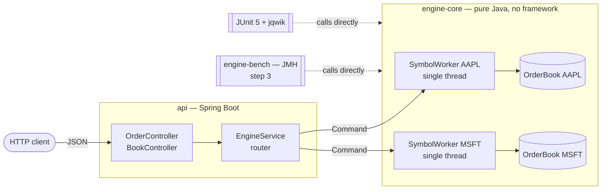
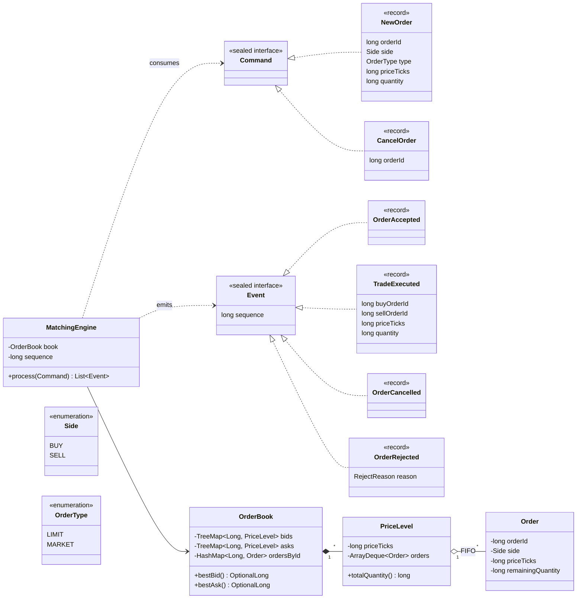
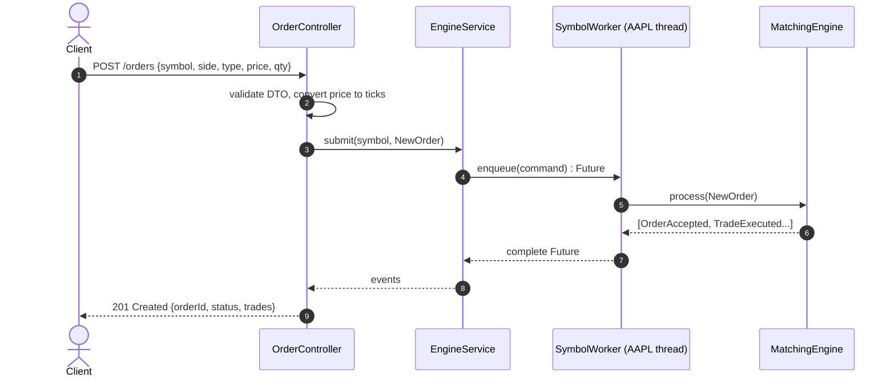
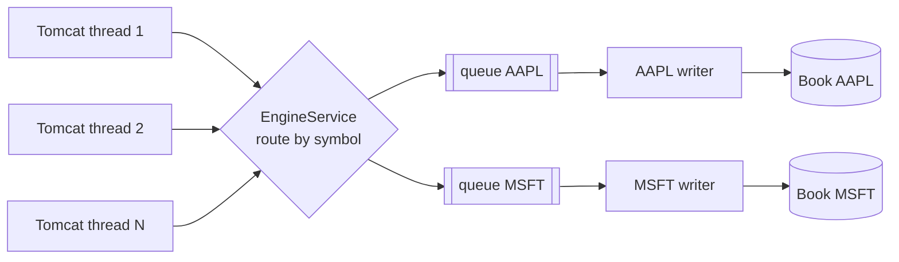

# Order Book — LOB Matching Engine

[](../../actions/workflows/ci.yml)


A **limit order book (LOB) matching engine** written in Java 21: price-time priority matching,
a REST API on Spring Boot, and published JMH benchmarks.

The goal is engineering rigour rather than feature count. The engine is **deterministic**,
backed by **invariant tests**, and **measured before it is optimised**.

> **Status: Step 0, Foundations.** The build, CI, module boundaries and architecture decisions
> are in place. The matching logic comes in Step 1 (see [Roadmap](#roadmap)).

---

## Table of contents

1. [Architecture](#architecture)
2. [Design patterns](#design-patterns)
3. [UML](#uml)
4. [Key technical decisions](#key-technical-decisions)
5. [Build & run](#build--run)
6. [Testing strategy](#testing-strategy)
7. [Roadmap](#roadmap)

---

## Architecture

**Guiding principle: the engine is a plain Java library. Spring Boot is only the access layer
around it.**



| Module | Responsibility | Allowed dependencies |
|---|---|---|
| `engine-core` | Order book, matching, commands and events | JDK only (Spring is **banned by the build**) |
| `api` | REST, validation, JSON, threads per symbol | `engine-core`, Spring Boot |
| `engine-bench` *(step 3)* | JMH micro-benchmarks | `engine-core`, JMH |

Why the core is isolated:
- **Benchmarks measure the algorithm**, not Tomcat or Jackson.
- **Core tests run in milliseconds** without a Spring context.
- The boundary is **checked by the compiler and by `maven-enforcer`**, not left to good intentions.

### Concurrency model

**Each order book is processed sequentially. Different books are processed in parallel.**

Matching depends on strict ordering: an incoming buy is matched against resting sells by best price, then by
arrival time. Two threads mutating the same book would break time priority. They could also fill the same
liquidity twice. Each instrument therefore owns **one single-writer thread**. Instruments never interact,
so they run in parallel with no locks.

---

## Design patterns

| Pattern | Where | Why |
|---|---|---|
| **Single Writer** (LMAX-style) | `SymbolWorker`: one thread owns one `OrderBook` | No locks and no races on the critical path. The result is deterministic. Real exchanges work this way. |
| **Command → Events** | `MatchingEngine.process(Command) : List<Event>` | One input and one output, with no hidden side effects. Tests read as "given these orders, expect these events". Replay comes for free (step 5). |
| **Algebraic data types** (sealed interfaces + records) | `Command`, `Event` | Java 21 `switch` pattern matching is **exhaustive**: forgetting to handle a case is a compile error. |
| **Router** | `EngineService` sends a command to the worker that owns its symbol | Keeps concurrency out of the domain. |
| **Adapter** (light hexagonal) | `api` translates HTTP and decimal prices to and from core commands and ticks | The domain stays independent of the transport. |

**Rejected for now (YAGNI):** a Strategy for the matching algorithm (there is only one: price-time),
an Observer or event bus, full hexagonal ports, Kafka, a database, and the LMAX Disruptor. Each can be
added later if a benchmark or a requirement justifies it.

---

## UML

### Class diagram: target domain model (step 1)



### Sequence diagram: `POST /orders` (step 2)



### Thread model



Many request threads feed one queue per symbol. A queue has exactly one consumer, so each book is
mutated by a single thread and never needs a lock.

---

## Key technical decisions

The full rationale is in [`docs/adr/0001-foundations.md`](docs/adr/0001-foundations.md).

| Decision | Choice | Reason |
|---|---|---|
| Price representation | `long` ticks | `double` causes rounding errors. `BigDecimal` allocates on the hot path. Conversion happens in the API layer. |
| Book sides | `TreeMap<Long, PriceLevel>` | Sorted best price in O(log n). Simple and correct first. |
| Time priority | `ArrayDeque<Order>` per price level | FIFO by construction. |
| Cancel | O(n) inside a price level (v1) | Deliberate. It will be measured with JMH and then optimised to O(1) in step 4. |
| Time source | Injected `Clock` and sequence numbers | Determinism and reproducible replay. |
| Errors | Typed `OrderRejected(reason)`, no exceptions on the hot path | Rejection is a business outcome, not an error. |
| Instruments | Declared at startup (`application.yml`) | Exchanges do not create symbols on demand. |

---

## Build & run

Requirements: **JDK 21+**. Maven is not required because the wrapper is included.

```bash
./mvnw verify                      # build + all tests
./mvnw -pl api spring-boot:run     # start the API on :8080
```

On Windows, use `mvnw.cmd` in place of `./mvnw`.

---

## Testing strategy

| Layer | Tooling | What it proves |
|---|---|---|
| Core scenarios | JUnit 5 + AssertJ | Partial fills, multi-level sweeps, FIFO at equal price, cancels, rejections |
| Core invariants | jqwik (property-based) | Book is never crossed, quantity is conserved, FIFO holds, no negative quantity |
| Web layer | `@WebMvcTest` | Validation and HTTP status codes |
| End-to-end | one `@SpringBootTest` | Wiring |
| Performance | JMH | Throughput and p50 / p99 / p99.9 latency, with published methodology |

---

## Roadmap

Each step can be delivered and demonstrated on its own.

| # | Step | Content | Status |
|---|---|---|---|
| 0 | **Foundations** | Maven multi-module, wrapper, CI, enforced module boundary, ADR | ✅ |
| 1 | **Core engine** | `OrderBook`: LIMIT / MARKET / cancel, JUnit scenarios, jqwik invariants | ⏳ |
| 2 | **Service** | One thread per symbol, Spring Boot REST API, web tests | |
| 3 | **JMH baseline** | `engine-bench` module, published throughput and latency | |
| 4 | **Measured optimisation** | O(1) cancel (intrusive list), fewer allocations, before/after benchmarks | |
| 5 | **Journal & replay** | Append-only command journal; exact state recovery after a crash | |
| 6 | **Market data** | WebSocket feed: top of book and L2 diffs | |
| 7 | **Advanced orders** | IOC, FOK, post-only, cancel/replace, self-trade prevention | |
| 8 | **Pre-trade risk** | Fat-finger checks, price bands, max quantity, circuit breaker | |
| 9 | **Low latency** | LMAX Disruptor, zero-allocation hot path, ZGC, SBE binary encoding | |
| 10 | **Options** | Call/put chains per strike and expiry, one book per contract | |

---

## Project layout

```
Order_Book/
├── engine-core/        pure-Java matching engine (no Spring, enforced)
├── api/                Spring Boot REST adapter
├── docs/adr/           architecture decision records
├── .github/workflows/  CI
└── mvnw, mvnw.cmd      Maven wrapper
```

---

## License

[MIT](LICENSE) © 2026 Ahmed Berrada
